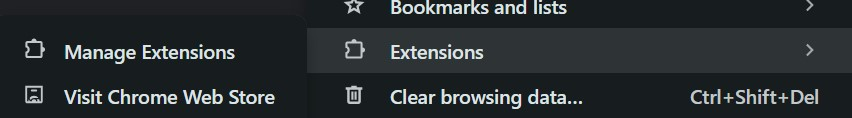
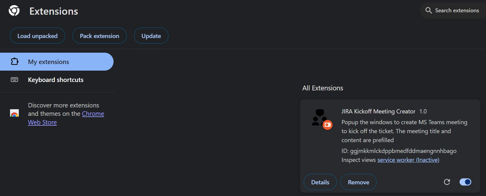

# jira-kickoff-teams-meeting-creator
This is a chrome extension to create Microsoft Teams meeting from a JIRA ticket

# How to use

1. Clone the repository to your local environment.
2. Access the Chrome Extensions page via the Menu `Extensions/ManageExtensions`.  
3. Click the `Load unpacked` button, select the `src` folder, and then click `Select Folder`. The extension will be loaded.   
4. Configure the JIRA subdomain within the extension's options. Input the subdomain corresponding to your JIRA URL. For instance, if your JIRA URL is `https://mtvt.atlassian.net/`, you should enter `mtvt`. You can access this setting in two ways:
   - Open the `Details` of the extension, navigate to `Extension options`, and open the settings page.
   - Click on the `Extensions` icon in the Chrome menu, locate the extension, click `...`, and then select `Options` from the menu.
5. Return to the JIRA page. Right-click on the ticket link. You will observe the `Schedule kickoff` option in the menu. Click it to launch the Microsoft Teams window, where the meeting title and content will be prefilled.  

# Note
It appears that multiline text is not fully supported in the Microsoft Teams Meeting Deep Link. In the meeting content, ` ` tags can be utilized to separate the story link and title into two lines in some Teams instances, though this functionality is not guaranteed for all users. The code is in the file `background.js`.
